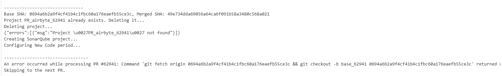
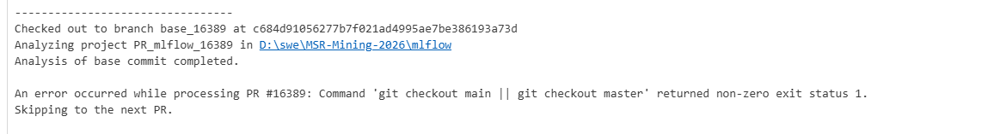
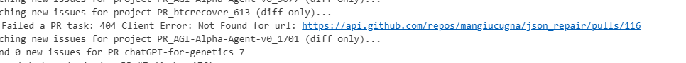
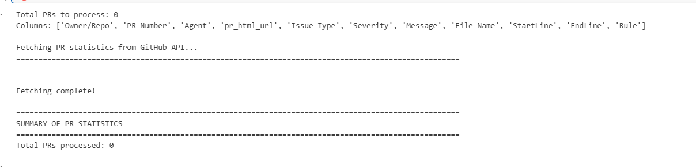

# Logs and Screenshots

During the run, we have encountered the following:
During the SonarQube analysis step, some of the PRs have failed to check out to and fetch the origin branch:

Logs of the security hotspot extraction step:

As you can see, there were some 404 errors, however, there were not much, and most likely they are due to the deleted/removed PRs.

Fetching of PR statistics from Github API have failed completely - there were no rows with 'SECURITY_HOTSPOT' issue type amongst our dataset, which is why the dataframe was 0 -> thus, there was nothing to fetch nor parse, and which is why this cell fails, it's expected, considering that original study had very small amount of Security Hotspot issue types as well:

